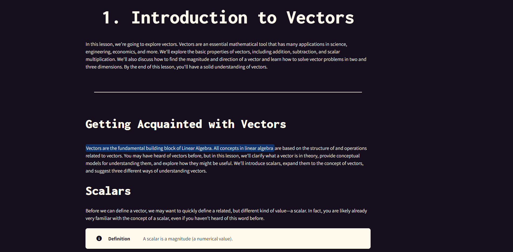
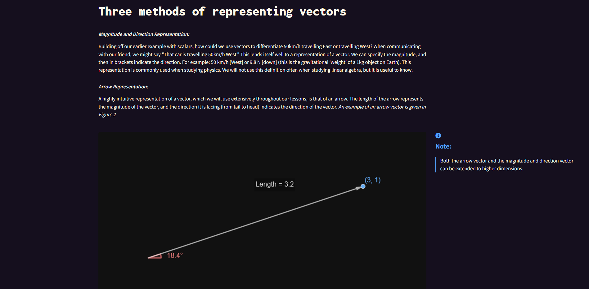
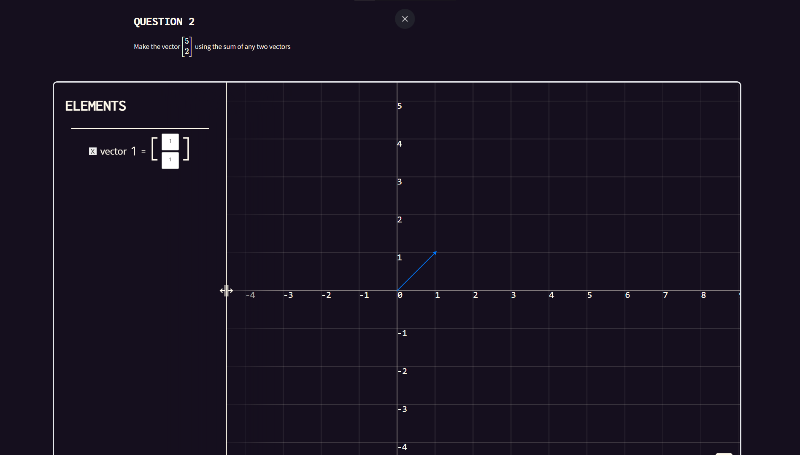
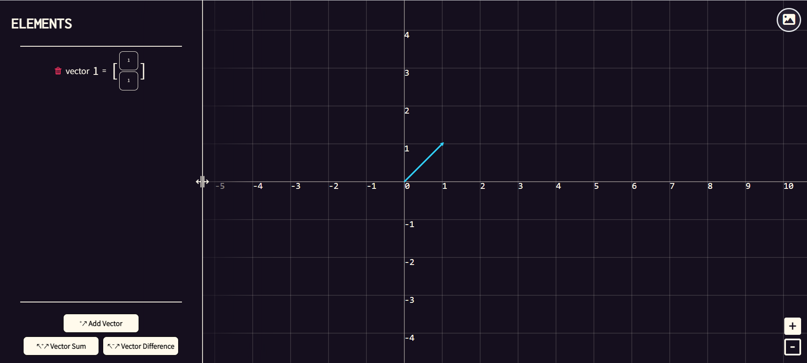
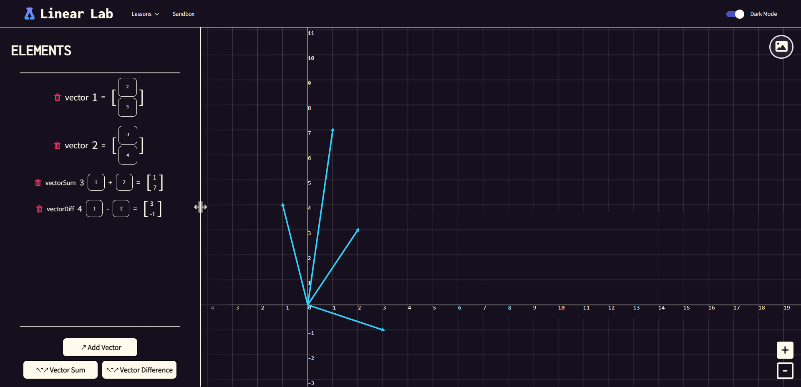

[![Contributors][contributors-shield]][contributors-url]
[![Stargazers][stars-shield]][stars-url]
[![Issues][issues-shield]][issues-url]

<!-- PROJECT LOGO -->
 

  

<h2 align="center">Linear Lab</h2>

  

    An interactive Linear Algebra textbook</a>.
  

---

Linear Lab is an interactive tool to help students learn about and visualize complex Linear Algebra concepts.  
We offer textbook-formatted lessons, sprinkled with interactive exercises that ensure student's understanding of material.  
A sandbox mode is also included to let students explore a visualization of two dimensional linear algebra.  
Try it out <a href="https://nickjg1.github.io/Linear-Lab/">here</a>!

### Built With

* [React](https://react.dev/)
* [Tailwind](https://tailwindcss.com/)
* [Elm](https://elm-lang.org/)

---

## Interactive Textbook

  

---

## Sandbox

  

---

(<a href="#top">back to top</a>)

[contributors-shield]: https://img.shields.io/github/contributors/nickjg1/Linear-Lab.svg?style=for-the-badge
[contributors-url]: https://github.com/nickjg1/Linear-Lab/graphs/contributors
[forks-shield]: https://img.shields.io/github/forks/nickjg1/Linear-Lab.svg?style=for-the-badge
[forks-url]: https://github.com/nickjg1/Linear-Lab/network/members
[stars-shield]: https://img.shields.io/github/stars/nickjg1/Linear-Lab.svg?style=for-the-badge
[stars-url]: https://github.com/nickjg1/Linear-Lab/stargazers
[issues-shield]: https://img.shields.io/github/issues/nickjg1/Linear-Lab.svg?style=for-the-badge
[issues-url]: https://github.com/nickjg1/Linear-Lab/issues
